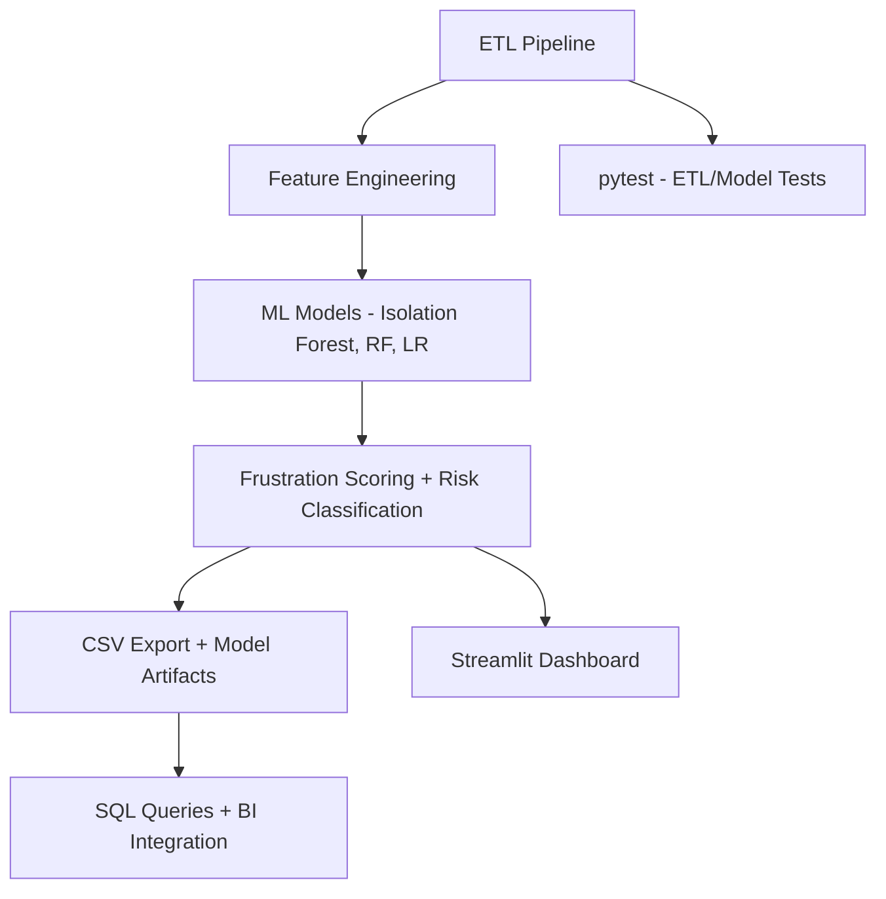

# Silent Churn Detection & Customer Frustration Analytics Platform

A production-grade, modular analytics platform designed to detect silent churn, quantify customer frustration, and generate actionable retention strategies. This solution covers the entire data lifecycle—from behavioral data simulation to dashboard-driven insights—and is tailored for use by data scientists, analysts, engineers, and business stakeholders.

---

## Features

- Synthetic customer data with realistic behavioral patterns
- ETL pipeline with feature engineering and processing
- Machine Learning models:
  - Isolation Forest (unsupervised anomaly detection)
  - Random Forest & Logistic Regression (supervised classification)
- Interactive Streamlit dashboard with KPI filters and visual exploration
- Business-driven recommendations based on behavioral signals
- SQL queries for BI team integration and segment analytics
- Pytest-based test suite for data pipeline validation
- Executive reporting ready for stakeholder communication

---

## Architecture Overview



---

## Technology Stack

| Component           | Technology                                 |
|---------------------|---------------------------------------------|
| Language            | Python 3.10+                                |
| Data Processing     | pandas, numpy                               |
| Machine Learning    | scikit-learn (IF, RF, LR), joblib           |
| Visualization       | plotly, seaborn, matplotlib                 |
| Dashboard           | Streamlit                                   |
| Testing             | pytest                                      |
| SQL Modeling        | PostgreSQL / MySQL-ready queries            |
| Deployment          | Modular file system, CLI or dashboard ready |

---

## Setup & Installation

### 1. Clone the Repository

```bash
git clone https://github.com/YOUR_USERNAME/silent-churn-platform.git
cd silent-churn-platform
```

### 2. Install Dependencies

```bash
pip install -r requirements.txt
```

### 3. Run the Pipeline

```bash
python main.py
```

### 4. Launch the Streamlit Dashboard

```bash
streamlit run dashboards/app.py
```

---

## Project Structure

```bash
silent-churn-platform/
├── main.py                # Driver script for full pipeline
├── data/                  # Processed datasets and exports
├── models/                # Trained ML models (.pkl)
├── dashboards/
│   └── app.py             # Streamlit analytics interface
├── sql/
│   └── churn_queries.sql  # Sample SQL models
├── tests/
│   └── test_etl.py        # Test cases for ETL pipeline
└── src/
    ├── etl.py             # Data simulation and preprocessing
    ├── modeling.py        # Model training and scoring
    ├── insights.py        # KPI generation and business insights
    ├── visualizations.py  # Plotting functions
    └── utils.py           # Shared helpers
```

---

## Deliverables

- Risk-classified customer dataset (`customer_frustration_analysis.csv`)
- Saved ML model (`customer_frustration_analysis_model.pkl`)
- At-risk segment insights with recommendations
- Interactive dashboard at `localhost:8501`
- SQL models for BI dashboards and reporting
- Pytest suite for ETL and model scoring

---

## Business Value

This platform enables:

- Early identification of silent churn and customer dissatisfaction
- Quantification of revenue at risk
- Customer segmentation and behavior profiling
- Targeted re-engagement recommendations
- End-to-end traceability from raw signals to stakeholder action

---

## Author

**Likitha Shatdarsanam**  
_Data & Analytics Professional | MS in Information Systems & Operations Management (Data Science), University of Florida_

- **Email:** shatdars.likitha@ufl.edu  
- **LinkedIn:** [linkedin.com/in/likitha-shatdarsanam-395362194](https://linkedin.com/in/likitha-shatdarsanam-395362194)

